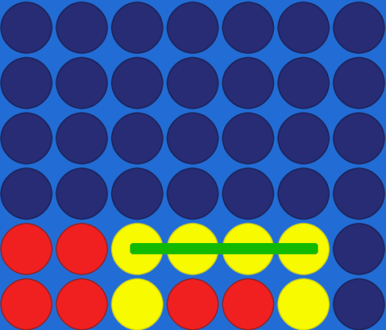

# Minimax Algorithm for Connect 4 with Alpha-Beta Pruning

## Overview
This project implements the Minimax algorithm with Alpha-Beta Pruning to make optimal decisions in the game "Connect 4".

## Table of Contents
1. [Problem Description](#problem-description)
2. [Decision-Making Process](#decision-making-process)
    - [Main Function: `find_best_move`](#main-function-find_best_move)
3. [Recursive Function: `minimax`](#recursive-function-minimax)
    - [Recursion Termination Condition](#recursion-termination-condition)
    - [Board Evaluation Formula](#board-evaluation-formula)
    - [Move Processing](#move-processing)
    - [Optimization: Alpha-Beta Pruning](#optimization-alpha-beta-pruning)
    - [Branch Search Termination Condition](#branch-search-termination-condition)
    - [Heuristic: `evaluate_board`](#heuristic-evaluate_board)
4. [Algorithm Execution Example](#algorithm-execution-example)
5. [Summary](#summary)

## Problem Description
The Connect 4 game requires placing four tokens in a row (horizontally, vertically, or diagonally) on a 6x7 board. The decision-making algorithm operates in two key steps:
1. The AI (computer) attempts to maximize its chances of winning.
2. The AI attempts to minimize the player's chances of winning.

The Minimax algorithm analyzes all possible moves up to a certain recursion depth (`MAX_DEPTH`) and selects the move that yields the best possible outcome, assuming optimal play from both sides. The Alpha-Beta Pruning optimization eliminates unnecessary calculations when further analysis does not affect the result.

## Decision-Making Process

### Main Function: `find_best_move`
The decision-making process starts in the `find_best_move` function, which:
1. Generates all legal moves (columns that are not full).
2. For each move:
    - Simulates the move by the AI on a copy of the board (`make_move`).
    - Calls the `minimax` function with the appropriate parameters:
      - Decreases recursion depth (`depth - 1`).
      - Alternates roles: AI → human player and vice versa.
    - Reverts the simulation (`undo_move`) after evaluation.
3. Returns the move with the highest evaluation score.

## Recursive Function: `minimax`

### Recursion Termination Condition
The recursion stops when:
- The maximum recursion depth is reached.
- The game ends with a win, calling `evaluate_board_after_move` to assess the board score heuristically.

### Board Evaluation Formula
The `score_position` function assigns values based on the number of tokens in a row:
- **2 tokens:** +5
- **3 tokens:** +50
- **4 tokens (win):** +1000

### Move Processing
- **Maximizing player (AI):**
  - For each possible move:
    - Simulates the move.
    - Calls `minimax` for the opponent (human player).
    - Maximizes the function result.
    - Updates the best score.
    - Stops processing if pruning condition is met.

- **Minimizing player (human):**
  - Similar process but minimizes the score.

### Optimization: Alpha-Beta Pruning
Alpha-Beta Pruning reduces the need to explore branches that do not affect the result, reducing computational complexity from \(O(b^d)\) (where \(b\) is the number of moves, \(d\) is recursion depth) to \(O(\sqrt{b^d})\) in the best case.

### Branch Search Termination Condition
```
if β ≤ α, then prune this branch.
```
### Branch Search Formula
$$
f(board) = ∑ score_position(board, x, y, player)   for (x, y) ∈ board
$$


### Heuristic: `evaluate_board`
The heuristic evaluates the board based on potential rows (2, 3, or 4 tokens). Higher values are assigned to lines close to winning. Example evaluation:
- **+5:** 2 tokens in a row.
- **+50:** 3 tokens in a row.
- **+1000:** 4 tokens (win).

## Algorithm Execution Example
**Board before move:**

- Available moves: columns 2, 6.

### AI (Maximizing Player) Simulates Move in Column 2:
1. Executes the simulation and calls `minimax` for the human player.
2. `minimax` analyzes possible responses, minimizing AI’s score.
3. AI records the evaluation score for column 2.


### AI Simulates Move in Column 6:
- Similar process as above.

### AI Selects the Move with the Highest Score.

## Summary
This algorithm effectively implements the decision-making process based on the Minimax algorithm and Alpha-Beta Pruning optimization. By evaluating the board heuristically, the AI makes moves that consider not only the current game state but also the opponent's future responses.
